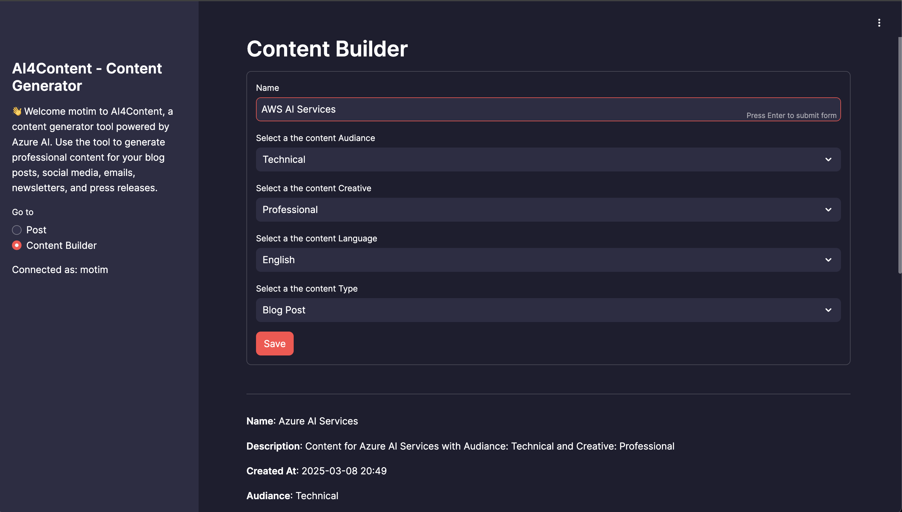
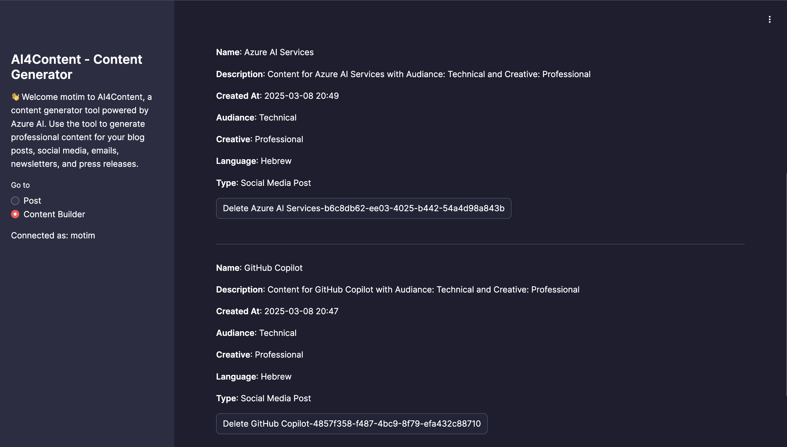

# AI4Content




AI4Content is a content generation tool powered by Azure AI. This application allows users to generate professional content for blog posts, social media, emails, newsletters, and press releases based on the latest news from user-provided topics. The tool leverages Bing Search API to retrieve the most recent and relevant news articles and uses Azure AI to create engaging and polished content.

## Features

- **User Authentication**: Secure login with username and password.
- **Content Generation**: Generate content based on user-provided topics using Azure AI and Bing Search API.
- **Content Management**: Save, retrieve, and delete generated content from Azure Table Storage.
- **Multi-language Support**: Generate content in multiple languages including English, Hebrew, Arabic, Spanish, and French.
- **Customizable Content**: Choose the audience, creative style, and type of content to be generated.

## Installation

1. Clone the repository:
    ```sh
    git clone <repository-url>
    cd <repository-directory>
    ```

2. Create a [.env](http://_vscodecontentref_/1) file in the root directory and add the following environment variables:
    ```env
    PROJECT_CONNECTION_STRING=<your_project_connection_string>
    AZURE_STORAGE_CONNECTION_STRING=<your_azure_storage_connection_string>
    ```

3. Install the required packages:
    ```sh
    pip install -r requirements.txt
    ```

4. Run the application:
    ```sh
    streamlit run main.py
    ```

## Usage

1. Open the application in your browser.
2. Log in with your username and password.
3. Navigate to the "Content Builder" page to create new content.
4. Save the content to Azure Table Storage.
5. Navigate to the "Post" page to generate posts based on the saved content.
6. View, manage, and delete generated posts.

## Docker

To run the application using Docker:

1. Build the Docker image:
    ```sh
    docker build -t ai4content .
    ```

2. Run the Docker container:
    ```sh
    docker run -p 80:80 ai4content
    ```

## Why AI4Content?

AI4Content simplifies the process of creating professional content by automating the generation of posts based on the latest news. It saves time and effort by leveraging Azure AI and Bing Search API to produce high-quality content tailored to your audience and creative style. Whether you need content for marketing, sales, HR, or any other purpose, AI4Content provides a seamless and efficient solution.

## License

This project is licensed under the MIT License.