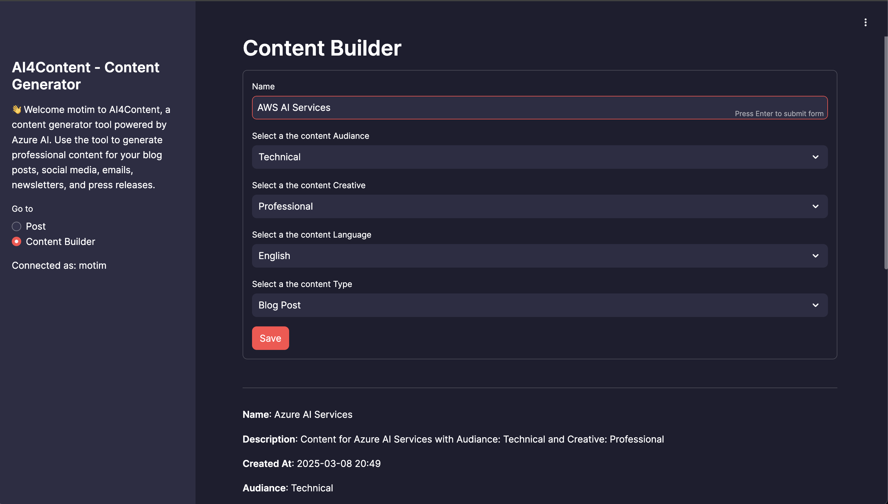
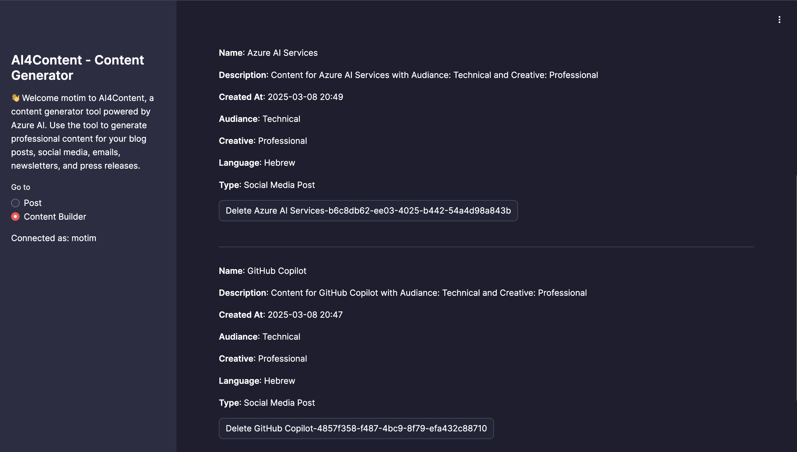
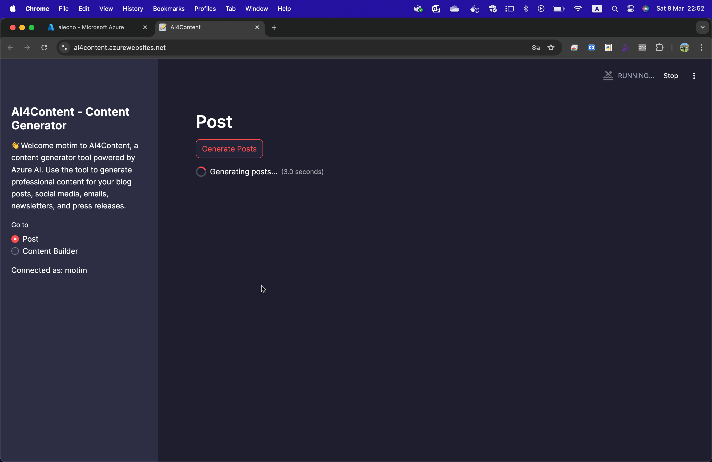
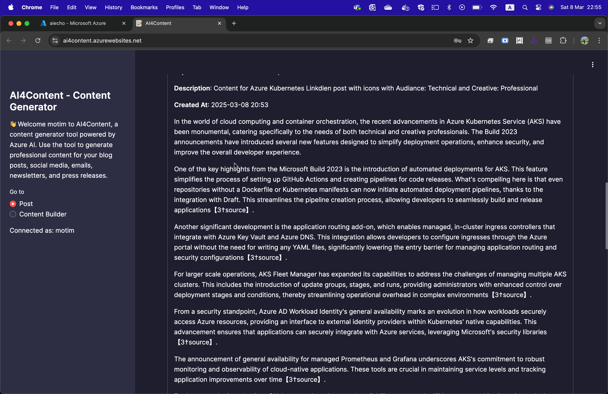

# 🚀 AI4Content

<p align="center">
    
    
    
    
</p>

Welcome to **AI4Content**, a powerful content generation tool powered by **Azure AI**. Whether you're crafting blog posts, social media updates, emails, newsletters, or press releases, AI4Content streamlines the process by generating professional, high-quality content based on the latest news and user-defined topics.

🔍 **Powered by AI & Bing Search API** – AI4Content scans the latest news, understands your needs, and delivers polished, engaging content.

## ✨ Features

- 🔑 **User Authentication** – Secure login with username and password.
- 📝 **Smart Content Generation** – Generate posts, emails, and more using Azure AI & Bing Search API.
- 📂 **Content Management** – Save, retrieve, and manage your content with Azure Table Storage.
- 🌍 **Multi-language Support** – Create content in English, Hebrew, Arabic, Spanish, French, and more.
- 🎨 **Customizable Content** – Tailor the audience, style, and format of your content.

## 🛠 Installation

### 1️⃣ Clone the Repository:
```sh
git clone <repository-url>
cd <repository-directory>
```

### 2️⃣ Set Up Environment Variables:
Create a `.env` file in the root directory and add:
```env
PROJECT_CONNECTION_STRING=<your_project_connection_string>
AZURE_STORAGE_CONNECTION_STRING=<your_azure_storage_connection_string>
```

### 3️⃣ Install Dependencies:
```sh
pip install -r requirements.txt
```

### 4️⃣ Run the Application:
```sh
streamlit run main.py
```

## 🐳 Run with Docker

Prefer containers? No problem! AI4Content is Docker-ready. Just:

```sh
docker build -t ai4content .
docker run -p 80:80 ai4content
```

## 🤖 Why AI4Content?

💡 **Effortless Content Creation** – No more writer’s block! AI4Content automates content generation, saving time and effort.

⚡ **Powered by AI & News Feeds** – Stay ahead with fresh, relevant content tailored to your needs.

🌍 **Multi-Use & Multi-Language** – From marketing to HR, AI4Content adapts to your goals and audience.

## 💙 Contribute & Join the Community

AI4Content is open source, and we welcome contributions from developers, AI enthusiasts, and content creators! Help us improve, add new features, and make AI-powered content creation even better.

🚀 **Ways to contribute:**
- Report issues & suggest features
- Improve documentation
- Add new features
- Optimize AI models & workflows

Start by forking the repo and submitting a PR!

## 📜 License

This project is licensed under the MIT License.

---

💡 *Have ideas or feedback? Let’s build something amazing together! 🚀*

