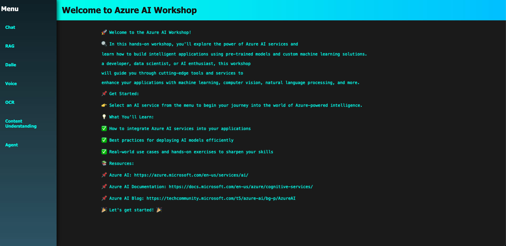

# Azure AI Workshop 🚀

Welcome to the **Azure AI Workshop**! This comprehensive hands-on workshop is designed to help you explore the cutting-edge power of Azure AI services and learn how to build intelligent applications using advanced AI models and custom machine learning solutions.



> 🎯 **Perfect for developers, data scientists, and AI enthusiasts** who want to master Azure AI services through practical, real-world challenges!

## 🌟 What Makes This Workshop Special

- **7+ Interactive Challenge Modules** with complete implementations
- **Advanced AI Techniques** including Function Calling, Vision AI, and Predicted Outputs
- **Real-world Use Cases** with practical applications
- **Complete Solution Files** and instructor guides
- **Progressive Learning Path** from basic chat to advanced AI agents

## 📚 Table of Contents

- [🔥 Featured Advanced Challenges](#-featured-advanced-challenges)
- [🎮 Workshop Modules](#-workshop-modules)
  - [💬 Chat](#-chat)
  - [🔍 RAG (Retrieval-Augmented Generation)](#-rag-retrieval-augmented-generation)
  - [🛠️ Function Calling](#️-function-calling)
  - [⚡ Predicted Outputs](#-predicted-outputs)
  - [👁️ Vision Chat](#️-vision-chat)
  - [🎨 DALL-E](#-dall-e)
  - [🎤 Voice](#-voice)
  - [📄 OCR (Optical Character Recognition)](#-ocr-optical-character-recognition)
  - [🧠 Content Understanding](#-content-understanding)
  - [🤖 Agent](#-agent)
- [🚀 Getting Started](#-getting-started)
- [📖 Resources](#-resources)

## 🔥 Featured Advanced Challenges

### 🛠️ **Function Calling Challenge**
Learn to build AI tools that can execute real functions and provide structured responses.
- **What you'll learn**: Tool integration, structured API responses, real-world AI automation
- **Key concepts**: Function schemas, two-step API processes, practical AI tools
- **Example**: Build a `getCurrentTime` helper that AI can call autonomously

### ⚡ **Predicted Outputs Challenge** 
Master latency optimization using Azure OpenAI's prediction capabilities.
- **What you'll learn**: Performance optimization, token prediction, cost efficiency
- **Key concepts**: Prediction parameters, acceptance rates, latency reduction
- **Examples**: FizzBuzz generator, Calculator, TodoList with optimized responses

### 👁️ **Vision Chat Challenge**
Create multimodal AI applications that can analyze and understand images.
- **What you'll learn**: Image processing, base64 encoding, multimodal AI interactions
- **Key concepts**: Detail levels, token economics for images, visual AI reasoning
- **Applications**: OCR, scene analysis, accessibility tools, automated image cataloging

## 🎮 Workshop Modules

### 💬 Chat

**Build your first AI-powered conversational interface!**

In the Chat module, you'll learn the fundamentals of integrating Azure OpenAI services to create intelligent chatbots. Master the art of handling user inputs, processing responses, and creating engaging conversational experiences.

**🎯 Learning Goals:**
- Azure OpenAI API integration
- Message handling and conversation flow
- Response formatting and display
- Error handling and user experience

---

### 🔍 RAG (Retrieval-Augmented Generation)

**Combine the power of search and generation for accurate, contextual responses!**

The RAG module focuses on building intelligent systems that can retrieve relevant information and generate accurate responses. Learn to integrate Azure Search with OpenAI to create knowledge-powered applications.

**🎯 Learning Goals:**
- Document retrieval strategies
- Vector and semantic search
- Context integration with AI responses
- Building knowledge-based chatbots

---

### 🛠️ Function Calling

**⭐ NEW ADVANCED CHALLENGE ⭐**

**Create AI agents that can execute real functions and automate tasks!**

Master the advanced technique of Function Calling, where AI models can intelligently decide when and how to call specific functions to accomplish user requests.

**🎯 Learning Goals:**
- Function schema definition
- Two-step API process implementation
- Tool integration patterns
- Real-world AI automation

**💡 What you'll build:**
- AI that can call `getCurrentTime()` function
- Structured response handling
- Multi-tool AI systems

**📁 Files:**
- Challenge: `js/function-calling.js`
- Solution: `solutions/function-calling-solution.js`
- Docs: `docs/function-calling-challenge.md`

---

### ⚡ Predicted Outputs

**⭐ NEW ADVANCED CHALLENGE ⭐**

**Optimize AI performance and reduce latency with intelligent predictions!**

Learn to use Azure OpenAI's predicted outputs feature to dramatically reduce response times and improve user experience through smart token prediction.

**🎯 Learning Goals:**
- Latency optimization techniques
- Token prediction strategies
- Performance vs. accuracy trade-offs
- Cost-effective AI implementations

**💡 Interactive Examples:**
- FizzBuzz Generator with prediction
- Smart Calculator responses
- TodoList with optimized completion

**📁 Files:**
- Challenge: `js/predicted-outputs.js`
- Solution: `solutions/predicted-outputs-solution.js`
- Docs: `docs/predicted-outputs-challenge.md`

---

### 👁️ Vision Chat

**⭐ NEW MULTIMODAL CHALLENGE ⭐**

**Build AI applications that can see and understand images!**

Create cutting-edge multimodal applications using Azure OpenAI's vision-enabled models. Learn to process images, ask questions about visual content, and build interactive vision-powered experiences.

**🎯 Learning Goals:**
- Multimodal AI model integration
- Base64 image encoding and processing
- Vision-text conversation flows
- Token economics for image processing

**💡 Real-world Applications:**
- OCR and text extraction
- Scene description and analysis
- Accessibility tools for visually impaired
- Automated image cataloging

**🔧 Key Features:**
- Drag-and-drop image upload
- Detail level selection (low/high/auto)
- Token usage tracking
- Multi-image analysis support

**📁 Files:**
- Challenge: `js/vision-chat.js`
- Solution: `solutions/vision-chat-solution.js`
- Docs: `docs/vision-chat-challenge.md`
- Instructor Guide: `docs/vision-chat-instructor-guide.md`

---

### 🎨 DALL-E

**Generate stunning images from text descriptions!**

Explore the creative possibilities of AI-generated art using Azure OpenAI's DALL-E model. Learn to send text prompts and create beautiful, unique images programmatically.

**🎯 Learning Goals:**
- Text-to-image generation
- Prompt engineering for better results
- Image handling and display
- Creative AI applications

---

### 🎤 Voice

**Convert speech to text with Azure Speech services!**

Master speech recognition technology by integrating Azure Cognitive Services. Learn to capture audio, process speech, and convert spoken words into actionable text.

**🎯 Learning Goals:**
- Speech-to-text integration
- Audio capture and processing
- Real-time transcription
- Voice-controlled applications

---

### 📄 OCR (Optical Character Recognition)

**Extract text and data from images and documents!**

Learn to use Azure Document Intelligence to analyze documents, extract text, and understand document structure with precision and accuracy.

**🎯 Learning Goals:**
- Document analysis and processing
- Text extraction from images
- Bounding box detection
- Structured data extraction

---

### 🧠 Content Understanding

**Analyze and comprehend complex document content!**

Use advanced Azure AI services to understand document context, extract key information, and analyze content structure for intelligent document processing.

**🎯 Learning Goals:**
- Advanced document analysis
- Key information extraction
- Content classification
- Intelligent document workflows

---

### 🤖 Agent

**Build comprehensive AI-powered assistants!**

Create sophisticated AI agents that combine multiple Azure AI services to assist users with complex, multi-step tasks and intelligent decision-making.

**🎯 Learning Goals:**
- Multi-service AI integration
- Agent design patterns
- Task orchestration
- Intelligent workflow automation

## 🚀 Getting Started

## ☁️ Azure Prerequisites & Infrastructure Setup

Before starting this workshop, you'll need to set up the following Azure resources and obtain the necessary credentials. This workshop integrates with multiple Azure AI services to provide a comprehensive learning experience.

### 🔑 Required Azure Services

#### 1. **Azure OpenAI Service** (Required for most modules)
- **Purpose**: Powers chat, function calling, predicted outputs, vision, and agent modules
- **Required Models**:
  - `gpt-4o-mini` or `gpt-4` (for chat and function calling)
  - `gpt-4-vision-preview` or `gpt-4o` (for vision module)
  - `text-embedding-ada-002` (for RAG module)
- **How to create**:
  ```bash
  # Create resource group
  az group create --name rg-azure-ai-workshop --location eastus2
  
  # Create Azure OpenAI resource
  az cognitiveservices account create \
    --name your-openai-resource \
    --resource-group rg-azure-ai-workshop \
    --location eastus2 \
    --kind OpenAI \
    --sku S0
  ```

#### 2. **Azure AI Search** (Required for RAG module)
- **Purpose**: Enables Retrieval-Augmented Generation (RAG) functionality
- **Configuration**: Basic tier minimum, Standard recommended
- **How to create**:
  ```bash
  az search service create \
    --name your-search-service \
    --resource-group rg-azure-ai-workshop \
    --location eastus2 \
    --sku Basic
  ```

#### 3. **Azure Speech Services** (Required for Voice module)
- **Purpose**: Speech-to-text and text-to-speech capabilities  
- **How to create**:
  ```bash
  az cognitiveservices account create \
    --name your-speech-resource \
    --resource-group rg-azure-ai-workshop \
    --location eastus2 \
    --kind SpeechServices \
    --sku S0
  ```

#### 4. **Azure Document Intelligence** (Required for OCR module)
- **Purpose**: Document analysis and OCR capabilities
- **How to create**:
  ```bash
  az cognitiveservices account create \
    --name your-document-intelligence \
    --resource-group rg-azure-ai-workshop \
    --location eastus2 \
    --kind FormRecognizer \
    --sku S0
  ```

#### 5. **Azure AI Foundry** (Required for Agent module)
- **Purpose**: Advanced AI agent creation and management
- **Prerequisites**: Azure OpenAI resource in the same region
- **Setup**: Create through [Azure AI Studio](https://ai.azure.com/)

### 📋 Required Information Checklist

Before starting, gather the following information from your Azure resources:

#### Azure OpenAI Configuration:
- [ ] **Endpoint URL**: `https://your-openai-resource.openai.azure.com/`
- [ ] **API Key**: Found in "Keys and Endpoint" section
- [ ] **Deployment Names**: 
  - Chat/Function Calling model (e.g., `gpt-4o-mini`)
  - Vision model (e.g., `gpt-4-vision-preview`)  
  - Embedding model (e.g., `text-embedding-ada-002`)
- [ ] **API Version**: `2024-10-21` or latest

#### Azure Search Configuration:
- [ ] **Search Endpoint**: `https://your-search-service.search.windows.net`
- [ ] **Admin Key**: Found in "Keys" section
- [ ] **Index Name**: Create an index or use existing
- [ ] **Semantic Configuration**: Set up semantic search configuration

#### Azure Speech Configuration:
- [ ] **Endpoint**: `https://your-region.api.cognitive.microsoft.com/`
- [ ] **Subscription Key**: Found in "Keys and Endpoint" section
- [ ] **Region**: Your Azure region (e.g., `eastus2`)

#### Azure Document Intelligence Configuration:
- [ ] **Endpoint**: `https://your-region.api.cognitive.microsoft.com/`
- [ ] **Subscription Key**: Found in "Keys and Endpoint" section

#### Azure AI Foundry Configuration:
- [ ] **Endpoint**: `https://your-ai-service.services.ai.azure.com/api/projects/your-project-name`
- [ ] **Access Token**: Get via `az account get-access-token --resource 'https://ai.azure.com'`
- [ ] **API Version**: `2025-05-01` or latest

### 💰 Cost Considerations

**Estimated costs for running this workshop:**

| Service | Tier | Estimated Cost/Hour | Notes |
|---------|------|-------------------|--------|
| Azure OpenAI | Standard | $0.10-$2.00 | Depends on model and usage |
| Azure AI Search | Basic | $0.36 | Monthly fixed cost |
| Speech Services | Standard | $0.15-$0.50 | Pay-per-transaction |
| Document Intelligence | Standard | $0.10-$1.00 | Pay-per-page |
| Azure AI Foundry | Consumption | $0.20-$1.00 | Based on agent usage |

> 💡 **Cost Optimization Tips:**
> - Use `gpt-4o-mini` instead of `gpt-4` for development
> - Enable predicted outputs to reduce token usage
> - Delete resources after completing the workshop
> - Set up budget alerts in Azure Portal

### 🔧 Quick Azure Setup Script

Use this script to create all required resources at once:

```bash
#!/bin/bash

# Variables
RESOURCE_GROUP="rg-azure-ai-workshop"
LOCATION="eastus2"
OPENAI_NAME="openai-workshop-$(date +%s)"
SEARCH_NAME="search-workshop-$(date +%s)"
SPEECH_NAME="speech-workshop-$(date +%s)"
DOC_INTEL_NAME="docintel-workshop-$(date +%s)"

# Create resource group
echo "Creating resource group..."
az group create --name $RESOURCE_GROUP --location $LOCATION

# Create Azure OpenAI
echo "Creating Azure OpenAI resource..."
az cognitiveservices account create \
  --name $OPENAI_NAME \
  --resource-group $RESOURCE_GROUP \
  --location $LOCATION \
  --kind OpenAI \
  --sku S0

# Create Azure Search
echo "Creating Azure Search service..."
az search service create \
  --name $SEARCH_NAME \
  --resource-group $RESOURCE_GROUP \
  --location $LOCATION \
  --sku Basic

# Create Speech Services
echo "Creating Speech Services..."
az cognitiveservices account create \
  --name $SPEECH_NAME \
  --resource-group $RESOURCE_GROUP \
  --location $LOCATION \
  --kind SpeechServices \
  --sku S0

# Create Document Intelligence
echo "Creating Document Intelligence..."
az cognitiveservices account create \
  --name $DOC_INTEL_NAME \
  --resource-group $RESOURCE_GROUP \
  --location $LOCATION \
  --kind FormRecognizer \
  --sku S0

echo "Resources created successfully!"
echo "Don't forget to:"
echo "1. Deploy models in Azure OpenAI Studio"
echo "2. Create search index in Azure Portal"
echo "3. Configure Azure AI Foundry project"
```

### 🎯 Minimum Setup for Quick Start

**If you want to try just a few modules, here's the minimum required:**

- **Chat Module Only**: Azure OpenAI with GPT model deployment
- **RAG Module**: Azure OpenAI + Azure AI Search with index
- **Vision Module**: Azure OpenAI with GPT-4 Vision model
- **Function Calling**: Azure OpenAI with GPT-4 or GPT-4o-mini
- **Agent Module**: Azure AI Foundry project + Azure OpenAI

### Prerequisites
- Basic knowledge of JavaScript and HTML
- Azure subscription with OpenAI service access
- Modern web browser
- Code editor (VS Code recommended)

### Quick Setup

1. **Clone the repository:**
   ```bash
   git clone <repository-url>
   cd AzureAIWorkshop
   ```

2. **Configure your Azure credentials:**
   - Edit `js/config.js` with your Azure OpenAI details
   - Add your endpoint, API key, and deployment names

3. **Start the local server:**
   ```bash
   python3 -m http.server 8000
   ```

4. **Open in browser:**
   Navigate to `http://localhost:8000`

5. **Start learning:**
   Select any module from the sidebar and begin your Azure AI journey!

### 📂 Project Structure
```
├── js/                          # Challenge files for students
│   ├── config.js               # Azure service configuration
│   ├── chat.js                 # Basic chat implementation
│   ├── rag.js                  # RAG challenge
│   ├── function-calling.js     # Function calling challenge
│   ├── predicted-outputs.js    # Predicted outputs challenge
│   └── vision-chat.js          # Vision chat challenge
├── solutions/                   # Complete implementations for instructors
│   ├── function-calling-solution.js
│   ├── predicted-outputs-solution.js
│   └── vision-chat-solution.js
├── docs/                        # Comprehensive documentation
│   ├── function-calling-challenge.md
│   ├── predicted-outputs-challenge.md
│   ├── vision-chat-challenge.md
│   └── vision-chat-instructor-guide.md
└── index.html                   # Main workshop interface
```

## 🏆 Learning Path Recommendations

### **Beginner Path:**
1. 💬 Chat - Learn the basics
2. 🔍 RAG - Add knowledge retrieval
3. 🎨 DALL-E - Explore creativity

### **Intermediate Path:**
4. 🛠️ Function Calling - Add tool integration
5. 👁️ Vision Chat - Explore multimodal AI
6. 🎤 Voice - Add speech capabilities

### **Advanced Path:**
7. ⚡ Predicted Outputs - Optimize performance
8. 🧠 Content Understanding - Advanced analysis
9. 🤖 Agent - Build comprehensive systems

## 📖 Resources

### 🔗 Official Azure Documentation
- **[Azure AI Services](https://azure.microsoft.com/en-us/products/ai-services/)** - Complete overview of Azure AI capabilities
- **[Azure OpenAI Documentation](https://learn.microsoft.com/en-us/azure/ai-services/openai/)** - Comprehensive guides and API references
- **[Azure AI Blog](https://techcommunity.microsoft.com/t5/azure-ai/bg-p/AzureAI)** - Latest updates and best practices

### � Learning Resources
- **[Function Calling Guide](https://learn.microsoft.com/en-us/azure/ai-services/openai/how-to/function-calling)** - Master AI tool integration
- **[Vision Models Documentation](https://learn.microsoft.com/en-us/azure/ai-services/openai/how-to/gpt-with-vision)** - Multimodal AI implementation
- **[RAG Implementation Guide](https://learn.microsoft.com/en-us/azure/search/retrieval-augmented-generation-overview)** - Knowledge-enhanced AI

### 🛠️ Developer Tools
- **[Azure AI Studio](https://ai.azure.com/)** - Experiment with AI models
- **[OpenAI Cookbook](https://github.com/openai/openai-cookbook)** - Code examples and recipes
- **[Postman Collection](https://www.postman.com/microsoft-azure/)** - API testing tools

### 💡 Advanced Topics
- **[Token Optimization Strategies](https://learn.microsoft.com/en-us/azure/ai-services/openai/concepts/understand-your-data)** - Cost and performance optimization
- **[Responsible AI Guidelines](https://www.microsoft.com/en-us/ai/responsible-ai)** - Ethical AI development
- **[Azure AI Security Best Practices](https://learn.microsoft.com/en-us/azure/ai-services/security-features)** - Secure AI implementations

---

## 🎉 Ready to Transform Your Applications with AI?

**This workshop provides everything you need to master Azure AI services:**

✅ **Progressive Learning** - Start with basics, advance to cutting-edge techniques  
✅ **Hands-on Practice** - Real code, real implementations, real results  
✅ **Complete Documentation** - Comprehensive guides for every challenge  
✅ **Instructor Support** - Detailed teaching materials and solutions  
✅ **Real-world Applications** - Build skills you'll use in production  

### 🚀 **Let's Build the Future with AI!** 🚀

Whether you're building chatbots, analyzing images, optimizing performance, or creating comprehensive AI agents, this workshop gives you the tools and knowledge to succeed in the rapidly evolving world of artificial intelligence.

**Start your AI journey today** - select a module from the sidebar and begin exploring the incredible possibilities of Azure AI! 

---

> 💪 **Challenge yourself**, 🧠 **expand your knowledge**, and 🏗️ **build amazing AI-powered applications** with Azure!

*Happy Learning! 🎓✨*