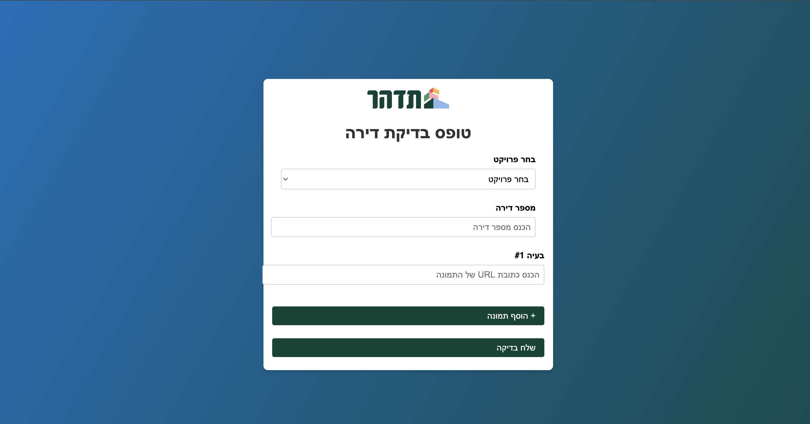
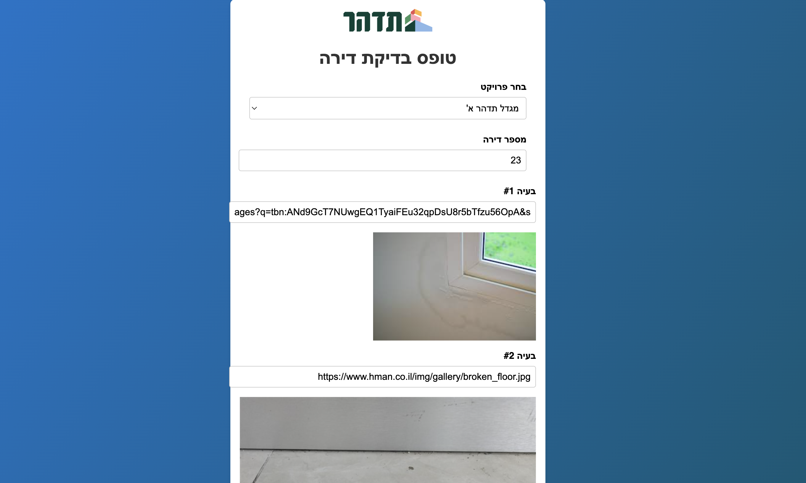

# Digital Apartment Inspection Form

This project is a **Digital Apartment Inspection Form** designed for Tidhar's site supervisors. It allows users to input multiple image URLs, analyze them using Azure Content Understanding, and display the results dynamically.

## Screenshots

### Form Interface


### Analysis Results



## Features

- **Project Selection**: Choose a project from a dropdown list.
- **Apartment Number Input**: Enter the apartment number for inspection.
- **Multiple Image URLs**: Add multiple image URLs dynamically.
- **Image Preview**: Preview each image before submitting.
- **Azure Content Understanding Integration**: Analyze each image using Azure's AI services.
- **Dynamic Results Display**: Show analysis results for each image, including translated fields in Hebrew.

## How It Works

1. **Add Image URLs**: Use the `+ הוסף תמונה` button to add multiple image URL inputs.
2. **Preview Images**: Each image URL entered will display a preview.
3. **Submit for Analysis**: Click the `שלח בדיקה` button to analyze all images sequentially.
4. **View Results**: The analysis results, including the image and translated fields, are displayed dynamically.

## Project Structure

```
.
├── inspection-form.html   # Main HTML file for the form
├── styles.css             # CSS file for styling
├── script.js              # JavaScript file for functionality
├── image1.png             # Screenshot of the form interface
├── image2.png             # Screenshot of the analysis results
└── README.md              # Project documentation
```

## Setup Instructions

1. Clone the repository:
   ```bash
   git clone <repository-url>
   cd AzureContentUnderstanding/Tidhar
   ```

2. Open `inspection-form.html` in a browser to use the form.

3. Ensure you have an active Azure Content Understanding service with the correct endpoint and subscription key configured in `script.js`.

## Azure Integration

This project uses Azure Content Understanding to analyze images. Ensure the following configurations in `script.js`:

- **Endpoint**: Replace `<your-endpoint>` with your Azure endpoint.
- **Subscription Key**: Replace `<your-subscription-key>` with your Azure subscription key.
- **Analyzer ID**: Replace `<your-analyzer-id>` with the ID of your custom analyzer.

## License

This project is licensed under the MIT License. See the `LICENSE` file for details.