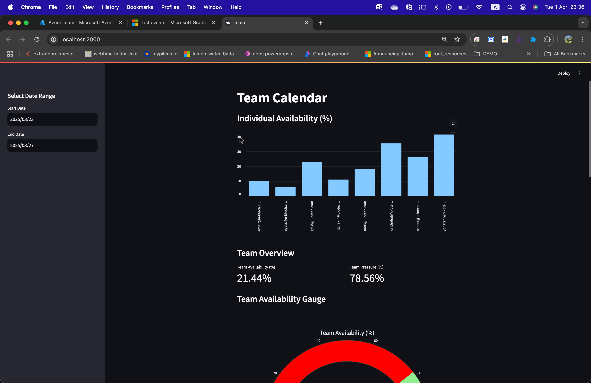
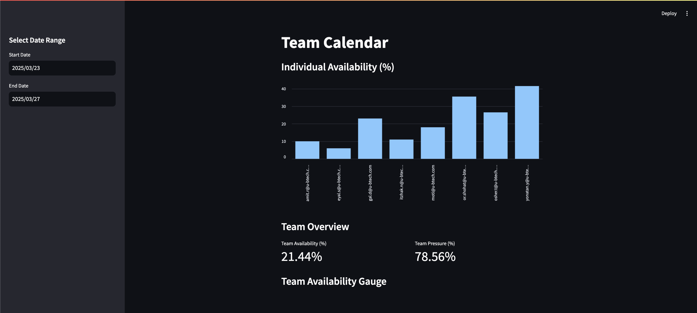
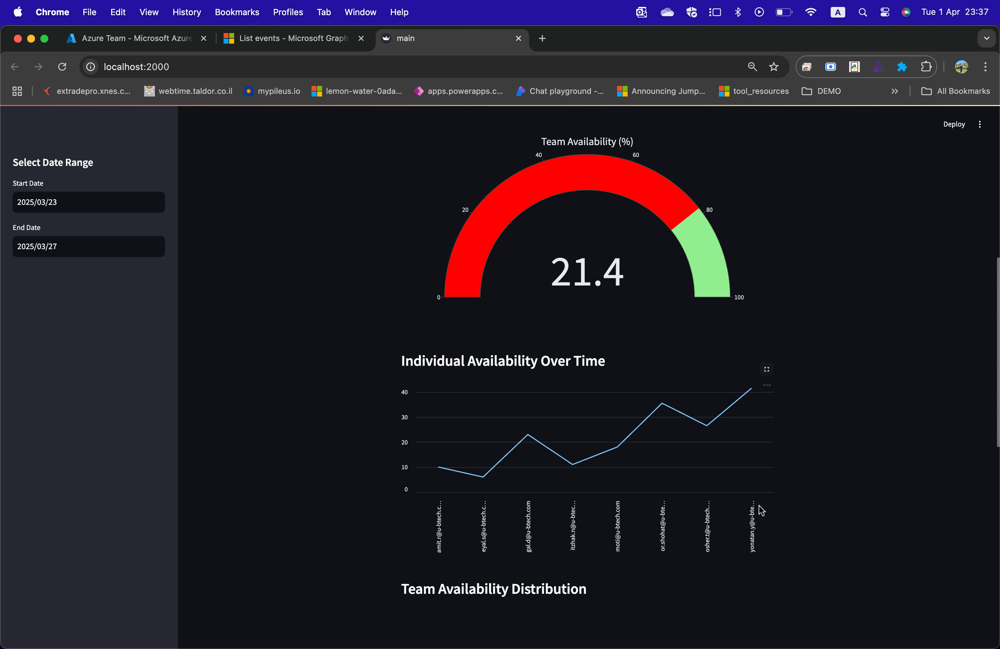
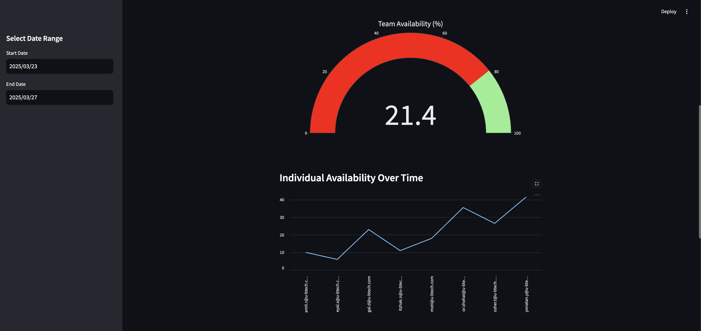

# Team Calendar Dashboard

The **Team Calendar Dashboard** is a Streamlit-based application that integrates with Microsoft Graph API to provide a comprehensive view of team availability, pressure, and individual schedules. It includes interactive visualizations such as gauges, line charts, and pie charts for better insights.

---

## Features

- **Team Availability Gauge**: Displays the overall team availability as a percentage.
- **Individual Availability Over Time**: Line chart showing availability trends for each team member.
- **Team Availability Distribution**: Pie chart visualizing the distribution of availability among team members.
- **Event List**: Detailed view of individual events with filtering for duplicates and irrelevant entries.
- **Custom Date Range**: Select a specific date range to analyze team schedules.
- **Working Hours Support**: Focuses on events within defined working hours (e.g., 8:00 AM to 6:00 PM).

---

## Screenshots

### Team Availability Gauge


### Individual Availability Over Time


### Team Availability Distribution


### Individual Events List


---

## Installation

1. Clone the repository:
   ```bash
   git clone https://github.com/your-repo/team-calendar-dashboard.git
   cd team-calendar-dashboard
   ```

2. Install dependencies:
   ```bash
   pip install -r requirements.txt
   ```

3. Set up environment variables:
   Create a `.env` file in the root directory with the following variables:
   ```env
   TENANT_ID=your_tenant_id
   CLIENT_ID=your_client_id
   CLIENT_SECRET=your_client_secret
   USERS_ID=user1_id,user2_id,user3_id
   ```

4. Run the application:
   ```bash
   streamlit run main.py
   ```

---

## Usage

1. **Authenticate**: The app will authenticate with Microsoft Graph API using the provided credentials.
2. **Select Date Range**: Use the sidebar to choose a custom date range for analysis.
3. **View Visualizations**: Explore the gauge, line chart, pie chart, and event list for insights into team schedules.

---

## Technologies Used

- **Streamlit**: For building the interactive dashboard.
- **Microsoft Graph API**: For fetching calendar events.
- **Plotly**: For creating advanced visualizations.
- **Pandas**: For data manipulation and analysis.
- **Python**: Core programming language.

---

## Folder Structure

```
/TeamCalader
├── main.py          # Main application file
├── .env             # Environment variables
├── requirements.txt # Python dependencies
├── /images          # Folder containing images for the README
└── README.md        # Project documentation
```

---

## Contributing

Contributions are welcome! Please fork the repository and submit a pull request with your changes.

---

## License

This project is licensed under the MIT License. See the [LICENSE](./LICENSE) file for details.

---

## Contact

For questions or support, please contact:
- **Name**: Your Name
- **Email**: your.email@example.com
- **GitHub**: [Your GitHub Profile](https://github.com/your-profile)
